# Kernel Flow

Fluxograma do caminho principal do kernel, baseado no fluxo atual de `lau_main()` e do loop de `kterm_run()`.

```mermaid
flowchart TD
    A[Bootloader e entrada de arquitetura] --> B[lau_main em kernel.c]
    B --> C[serial_init e kdisplay_init]
    C --> D{ARCH_X86_64}
    D -- sim --> E[Configura IDT e IRQs\nload_IDT\nktimer_init\nserial_init_irq\nmouse_init]
    D -- nao --> F[arch_enable_interrupts]
    E --> F
    F --> G[heap_init e kbootlog_enable_file]
    G --> H[heap_self_test]
    H --> I[ksys_init]
    I --> J[ksecurity_init]
    J --> K[kdebug_history_init e kdebug_timer_reset]
    K --> L[kevent_init]
    L --> M{ata_init ok}
    M -- sim --> N{kfs_persist_load ok}
    N -- sim --> O[KFS carregado do disco]
    N -- nao --> P[Disco presente sem dados salvos]
    M -- nao --> Q[Sem disco de armazenamento]
    O --> R{klua_init ok}
    P --> R
    Q --> R
    R -- nao --> S[Boot segue sem Lua]
    R -- sim --> T[Registra APIs Lua\nkfs sys sync memory\nprocess keyboard format\nevent debug io serial]
    T --> U[klua_run de bootstrap\nprint e boot.log]
    U --> V{init.lua existe}
    V -- sim --> W[klua_run_quiet init.lua]
    V -- nao --> X[Segue boot]
    W --> Y[kprocess_create de selftests]
    X --> Y
    S --> Z[8 ciclos de kprocess_tick]
    Y --> Z
    Z --> AA[kcheckup_run]
    AA --> AB[boot_countdown_to_terminal\nkio_clear]
    AB --> AC[kterm_run]

    subgraph Runtime [Loop interativo do terminal]
        AC --> AD[Mostra help inicial e prompt]
        AD --> AE[kprocess_poll e keventlua_dispatch]
        AE --> AF{keyboard_getkey_nonblock}
        AF -- nao --> AE
        AF -- sim --> AG[kevent_push_string key_pressed]
        AG --> AH{tecla Enter}
        AH -- sim --> AI[kdebug_history_push e kterm_exec]
        AI --> AJ{linha Lua ou comando interno}
        AJ -- Lua --> AK[klua_cmd_run_line ou klua_run]
        AJ -- interno --> AL[Comandos de KFS\nprocesso debug sys e afins]
        AK --> AM[Imprime novo prompt]
        AL --> AM
        AM --> AE
        AH -- nao --> AN[Edita buffer\nbackspace cursor historico]
        AN --> AE
    end
```

Resumo prático: o kernel sobe drivers e subsistemas base, tenta montar o estado persistido em KFS, inicializa a VM Lua como interface principal, agenda alguns processos de teste e então entrega o controle ao terminal, onde o loop mistura input de teclado, despacho de eventos Lua e polling do scheduler.
